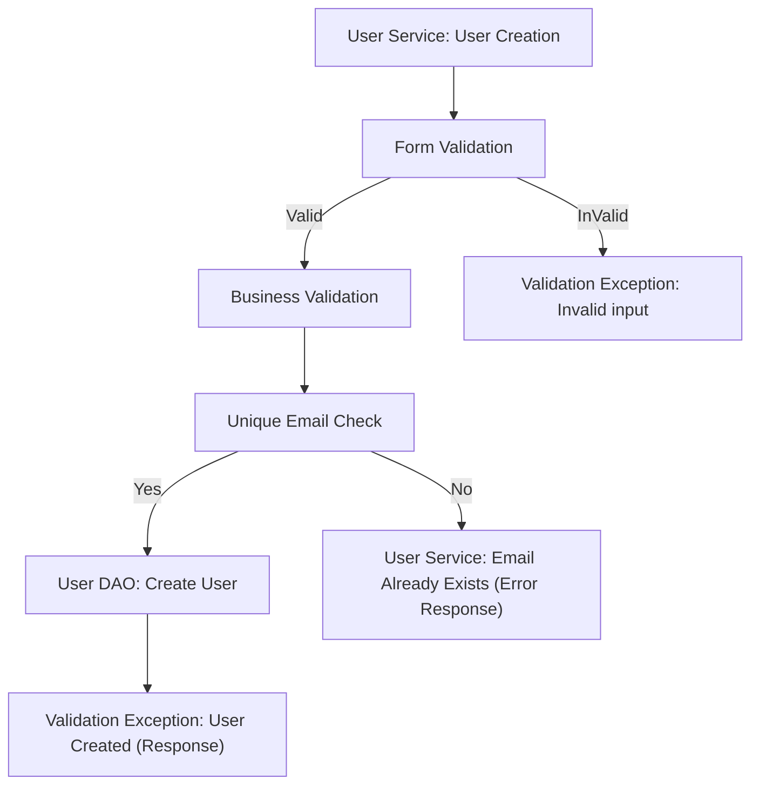
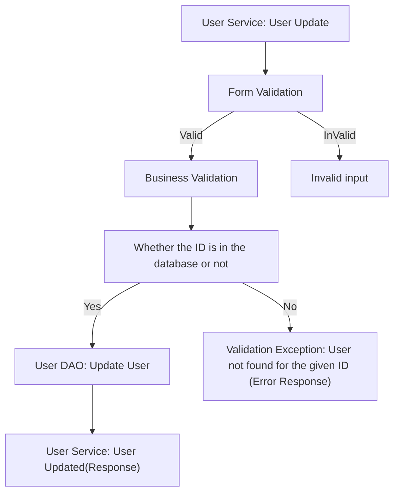
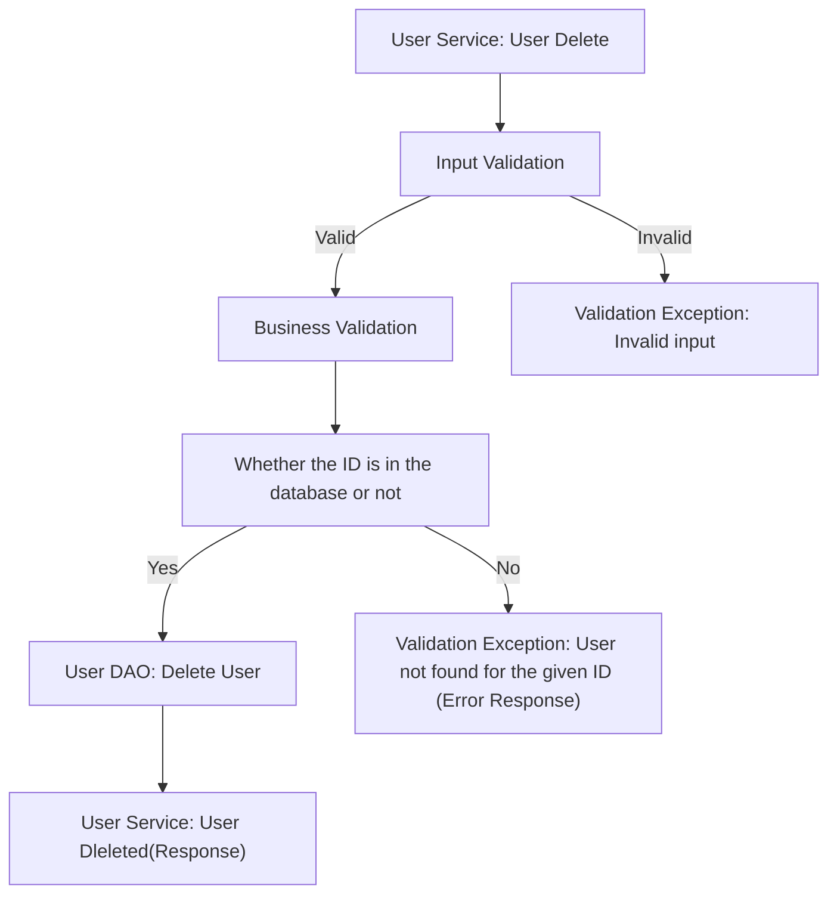
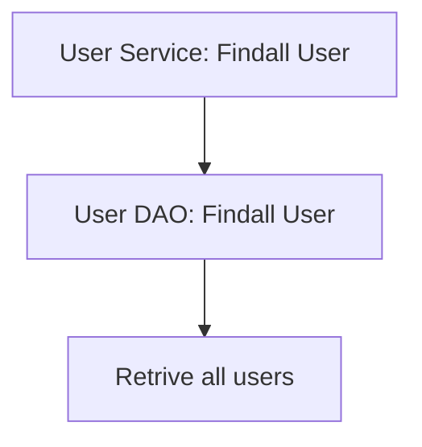
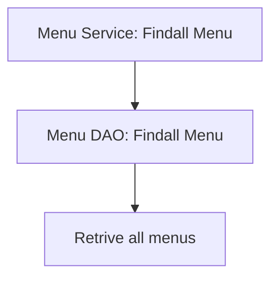
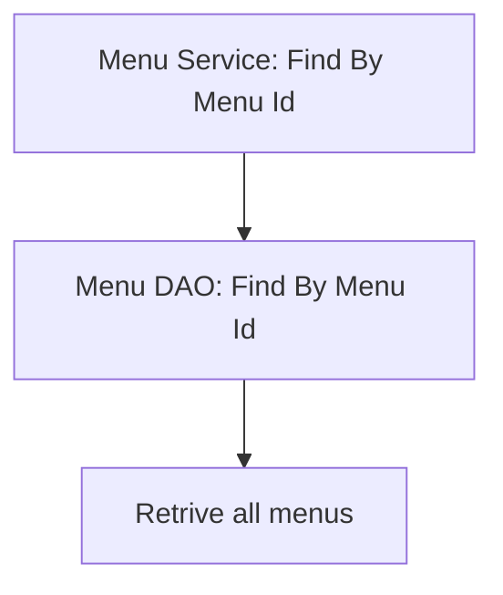
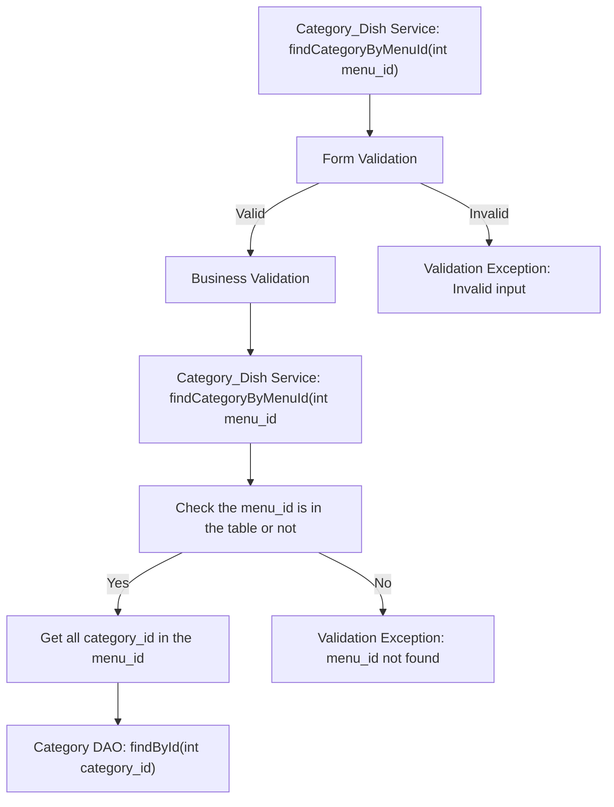
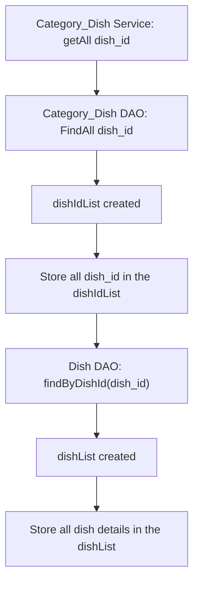
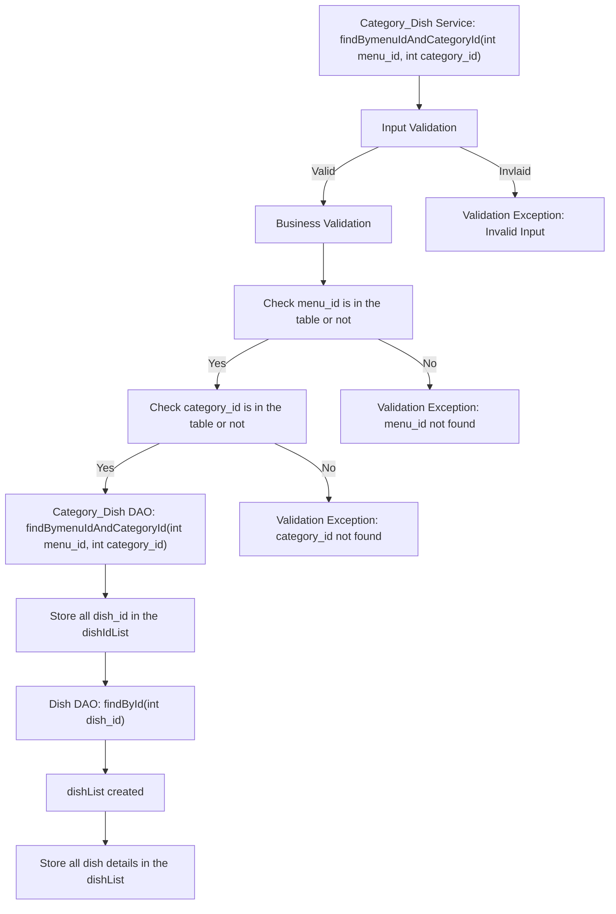

# Milestone - 1
# SR Catering Application Checklist

## Database Design

- [ ] Create an ER diagram of the database
- [ ] Write Create table scripts [script](path/to/sql/file)


## Project Setup

- [ ] Create a new Java project
- [ ] Set up a MySQL database
- [ ] Add necessary libraries
	- [ ] JDBC, 
	- [ ] MySQL Connector, 
	- [ ] JUnit, 
	- [ ] Dotenv

## Module 1: User
#### Pre-requisites:
- [ ] Create User table
-  Attributes
		- int id
		- String name
		- String email
		- long phone_number
		- String password
		- boolean status
- [ ] User DAO
- [ ] User Service

		
### Feature 1: Create User
#### User story
User can create their profile.
#### Pre-requisites:
- Implements User Service(create)
- Implement User DAO(create)

#### Validation
- [ ] Form validation
		- user null
		- name (null or empty string)
		- email (null or empty string)
		- email pattern validation
		- password (null or empty string)
		- phone_number ( length, >= 600000001 && <= 9999999999 )
- [ ] Business validation
		- email alreadyExists 		
		
#### Messages
- [ ] User cannot be null
- [ ] Invalid Email Id
- [ ] Password doesn't match the required format
- [ ] name cannot be null or empty
- [ ] email cannot be null or empty
- [ ] password cannot be null or empty
- [ ] phone_number doesn't match the required format
- [ ] User already exists(Business validation)


#### Flow: 


### Feature 2: Update User
#### User story
User can update their profile.
#### Pre-requisites:
- Implements User Service(update(int id, User user))
- Implement User DAO(update(int id, User user))

#### Validation
- [ ] Form validation
		- id <=0
		- user null check
		- name (null or empty string)
		- email (null or empty string)
		- password (null or empty string)
		- phone_number ( length, >= 600000001 && <= 9999999999 )
- [ ] Business validation
		- Check whether id is in the table or not 

#### Messages
- [ ] User cannot be null
- [ ] name cannot be null or empty
- [ ] email cannot be null or empty
- [ ] password cannot be null or empty
- [ ] Invalid Email Id
- [ ] Password doesn't match the required format
- [ ] phone_number doesn't match the required format
- [ ] User Id not found(Business validation)		
		
#### Flow: 


### Feature 3: Delete User
#### User story
User can delete their profile.
#### Pre-requisites:
- Implements User Service(delete(int id))
- Implement User DAO(delete(int id))

#### Validation
- [ ] Form validation
		- id <=0
- [ ] Business validation
		- Check whether id is in the table or not

#### Messages
- [ ] Invalid Id
- [ ] User Id not found(Business validation)		

#### Flow: 


### Feature 4: FindAll
#### User story
User can see all User details.
#### Pre-requisites:
- Implements User Service(getAll( ))
- Implement User DAO(findAll( ))

#### Flow: 


## Module 2: Menu
#### Pre-requisites:
- [ ] Create Menu table
-  Attributes
		- int id
		- String menu_name
- [ ] Menu Service
- [ ] Menu DAO
	
### Feature 1: FindAll
#### Admin story
Admin can see all Menu details.
#### Pre-requisites:
- Implements Menu Service(getAll( ))
- Implement Menu DAO(findAll( ))

#### Flow: 


### Feature 2: Find By MenuId
#### Admin story
Admin can find menu by menu_id.
#### Pre-requisites:
- Implements Menu Service(findByMenuId( ))
- Implement Menu DAO(findByMenuId( ))

#### Flow: 


## Module 2: Category
#### Pre-requisites:
- [ ] Create Category table
-  Attributes
		- int id
		- String category_name
		- String menu_id (foreign key)
- [ ] Category Service
- [ ] Category DAO


### Feature 1: FindAll Category By Menu id
#### Admin story
Admin can see all Category details by menu_id.
#### Pre-requisites:
- Implements Category_Dish Service(findCategoryByMenuId( ))
- Implement Category_Dish DAO(findCategoryByMenuId( ))
- Implements Category Service(getAll( ))
- Implement Category DAO(findAll( ))

#### Validation
- [ ] Form Validation
		- menu_id <= 0
- [ ] Business Validation
		- check menu_id is in the table or not

#### Messages
- [ ] Invalid menu_id
- [ ] menu_id not found

#### Flow: 


## Module 3: Dish
#### Pre-requisites:
- [ ] Complete Menu module Feature 1
- [ ] Complete Category module Feature 1
- [ ] Create Dish_Price Table
- [ ] Create Dish_Price Service
- [ ] Complete Dish_Price DAO
- [ ] Create Category_Dishes Table
- [ ] Create Category_Dishes Service
- [ ] Complete Category_Dishes DAO
- [ ] Create Dish table
- [ ] Dish Entity model (abstract class)
-  Attributes
		- int id
		- String dish_name
		- int quantity
		- String quantity_unit
		- int price
		- int menu_id (foreign key)
		- int category_id (foreign key)
		- Date start_date
		- Date end_date
		- boolean status
- [ ] Dish extends Dish Entity model

### Feature 1: Create Dish
#### Admin story
Admin can create Dish.
#### Pre-requisites:
- Implements Dish Service(create)
- Implement Dish DAO(create)-String dish_name, int quantity,String quantity_unit
- Implement Category_Dish Service(create)
- Implement Category_Dish DAO(create)-menu_id(foreign key), category_id(foreign key), dish_id(foreign key), status
- Implement Dish_Price Service(create)
- Implement Dish_Price DAO(create)-int price, start_date, end_date, dish_id(foreign key)

#### Validation
- [ ] Form Validation
		- dish null check
		- quantity <0 && quantity >=10
		- dish_name (null or empty string)
		- quantity_unit (null or empty string)
		- menu_id <=0
		- category_id <=0
		- price <=0
- [ ] Business Logic
		- Is the menu_id is in the Menu table?
		- Is the category_id is in the Category table?
		- dish name alreadyExists in the same Menu & Category in 		Category_Dish table

#### Messages
- dish cannot be null
- Invalid quantity
- dish_name cannot be null or empty
- quantity_unit cannot be null or empty
- Invalid menu_id
- Invalid category_id
- Invalid price
- menu_id not found (Business Validation)
- category_id not found (Business Validation)
- dish_name alreadyexists(Business Validation)


#### Flow: 
```mermaid
graph TD;
  A["Dish Service: Dish Creation"] --> B["Form validation"]
B -- Valid --> C0["Business Validation"]
C0 --> C["Category_Dish Service"]
B -- Invalid --> C1["Validation Exception: Invalid input"]
C --> D0["Check the menu_id is in the table or not"]
D0 -- Yes --> D["Check the category_id is in the table or not"]
D0 -- No --> D1["Validation Exception: menu_id not found"]
D -- Yes --> E["Check the dish_name already exists"]
D -- No --> E1["Validation Exception: category_id not found"]
E -- Yes --> F["dish_name already exists"]
E -- No --> F1["Dish DAO: Create Dish"]
F1 -- dish_id --> G["Category_Dish DAO: Category_Dish Creation"]
F1 -- dish_id --> H["Dish_Price DAO: Dish_Price Creation"]
  ```

### Feature 2: Update Dish
#### Admin story
Admin can upate Dish details.
#### Pre-requisites:
- Implements Dish Service(update)-int dish_id, Dish dish
- Implement Dish DAO(update)- quantity, quantity_unit, dish_id
- Implement Category_Dish Service(update)
- Implement Category_Dish DAO(update)- dish_id(foreign key), status
- Implement Dish_Price Service(update)
- Implement Dish_Price DAO(update)-price, dish_id(foreign key)

#### Validation
- [ ] Form Validation
		- dish null check
		- id<=0
		- quantity <0 && quantity >=10
		- quantity_unit (null or empty string)
		- price <=0
- [ ] Business Logic
		- Is the dish_id is in the table or not?

#### Messages
- dish cannot be null
- Invalid quantity
- quantity_unit cannot be null or empty
- Invalid price
- dish_id not found (Business Validation)
		

#### Flow: 
```mermaid
graph TD;
  A["Dish Service: Dish Updation"] --> B["Form validation"]
B -- valid --> C0["Business Validation"]
C0 --> C["Category_Dish Service"]
B -- Invalid --> D["Validation Exception: Invalid input"]
C --> E["Check whether the dish_id is in the Category_Dish table or not"]
E -- Yes -->F["Dish DAO: Update Dish"]
E -- No -->F1["Validation Exception: dish_id not found"]
F --> G["Dish_Price: Update Dish_Price"]
G --> H["Set the end_date on current Price"]
H --> I["Dish_Price: Create Dish_Price"]
  ```

### Feature 3: Delete Dish
#### Admin story
Admin can delete Dish.
#### Pre-requisites:
- Implement Category_Dish Service(delete)- int dish_id
- Implement Category_Dish DAO(delete)- int dish_id

#### Validation
- [ ] Form Validation
		- id <=0
- [ ] Business Validation
		- Check dish_id is in the table or not

#### Messages
- Invalid dish_id
- dish_id not found (Business Validation)

		
#### Flow: 
```mermaid
graph TD;
  A["Dish Service: Dish deletion"] --> B["Form validation"]
B -- Valid --> C["Business Validation"]
B -- Invalid--> C1["Validation Exception: Invalid input"]
C --> D["Category_Dish Service: Delete Dish"]
D --> D1["Check whether the dish_id is in the Category_Dish table or not"]
D1 -- Yes --> E["Category_Dish DAO: Delete Dish"]
D1 -- No --> E1["Validation Exception: dish_id not found"]
  ```

### Feature 4: FindBy Dish Id
#### Admin story
Admin can find Dish by dish_id.
#### Pre-requisites:
- Implement Category_Dish Service(findById)- int dish_id
- Implement Category_Dish DAO(findById)- int dish_id
- Implement Dish Service(findById)- int dish_id
- Implement Dish DAO(findById)- int dish_id

#### Validation
- [ ] Form Validation
		- id <=0
- [ ] Business Validation
		- Check dish_id is in the table or not


#### Flow: 
```mermaid
graph TD;
  A["Dish Service: findByDishId(dish_id)"] --> 
  B["Input validation"]
  B -- Valid --> B1["Business Validation"]
  B -- Invalid --> B2["Validation Exception: Invalid Input"]
  B1 --> B3["Category_Dish Service: findByDishId(dish_id)"]
  B3 --> C["Check whether dish-id is in the table or not"]
  C -- Yes --> D["Dish DAO: findByDishId(dish_id)"]
  C -- No --> D1["Validation Exception: dish_id not found"]
```


### Feature 5: ListAll Dish
#### Admin story
Admin can find all Dishes.
#### Pre-requisites:
- Implement Category_Dish Service(getAll)
- Implement Category_Dish DAO(findAll)
- Complete Dish Service(findById)- int dish_id
- Complete Dish DAO(findById)- int dish_id

#### Flow: 


### Feature 6: FindAll Dishes By menu_id & category_id
#### Admin story
Admin can find all Dishes by menu_id and category_id.
#### Pre-requisites:
- Implement Category_Dish Service findDishesByMenuIdCategoryId(int menu_id, int category_id)
- Implement Category_Dish findDishesByMenuIdCategoryId(int menu_id, int category_id)
- Complete Dish Service(findById)- int dish_id
- Complete Dish DAO(findById)- int dish_id

#### Validation
- [ ] Form Validation
		- menu_id <=0
		- category_id <=0
- [ ] Business Validation
		- Check menu_id is in the table or not
		- Check category_id is in the table or not

#### Messages
- Invalid menu_id
- Invalid category_id
- menu_id not found (Business Validation)
- category_id not found (Business Validation)

#### Flow: 

